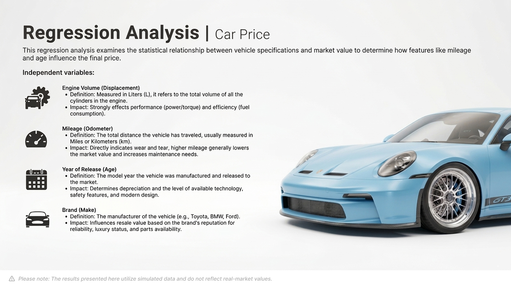
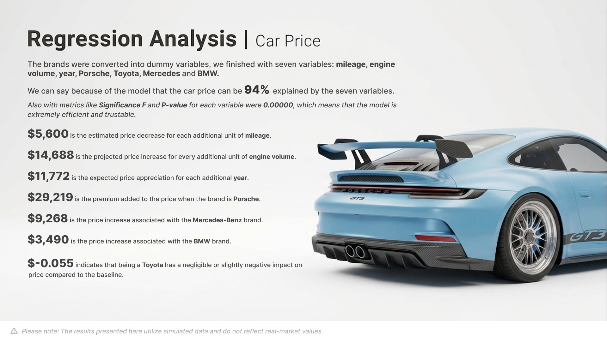

# Regression Analysis: Car Price Prediction

This project focuses on building a regression model to predict car prices based on key features such as engine volume, mileage, year, and brand.
The objective is to understand how different variables impact price and evaluate the model’s performance using statistical metrics.

